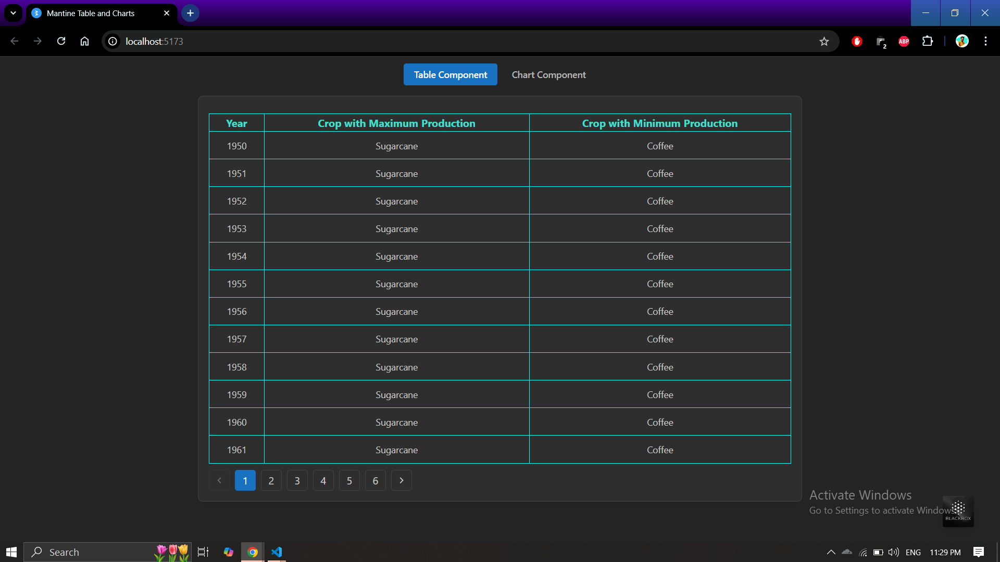
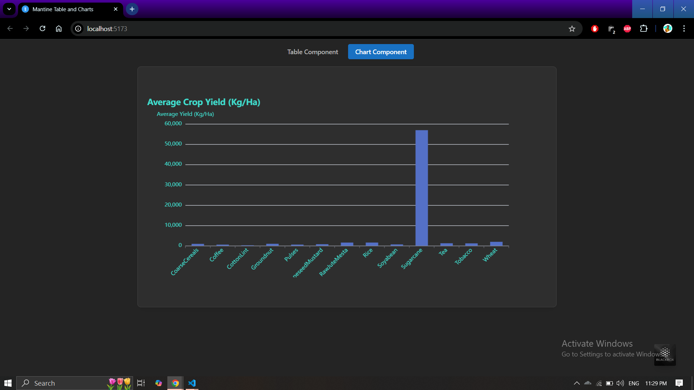

# Crop Data Visualization

## **Description**
This project is a React-based web application designed to analyze and visualize crop production data. It consists of two components:
1. A **Table Component** that displays the crop with the maximum and minimum production for each year between 1950 and 2020.
2. A **Bar Chart Component** that plots the average yield of each crop on the y-axis and the crop name on the x-axis.

The data is visualized using **Mantine** UI for the table and **Apache ECharts** for the bar chart.

## **Features**
- **Table Component**: Aggregates crop data by year, showing the crop with the maximum and minimum production for each year.
- **Bar Chart Component**: Displays the average yield for each crop between 1950-2020.

## **Technologies Used**
- **Frontend**: React, TypeScript
- **UI**: Mantine v7
- **Charting**: Apache ECharts
- **State Management**: React `useState`, `useEffect`
- **Styling**: CSS Modules
- **Data**: Static JSON dataset

## **Installation**

To get started with this project locally, follow the steps below:

1. **Clone the repository**:
   git clone https://github.com/ANXHMNTRA/react_mantine_table_and_Chart

2.**navigate into folder**:
   cd react_mantine_table_and_Chart

3. **Install dependencies**:
    yarn install
    
4. **Start the development server**:
    yarn dev

5. **Open the app**: 
    The application will be available at http://localhost:5173 by default.

### Table Component

### Bar Chart Component

